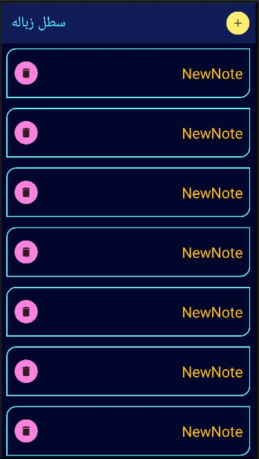
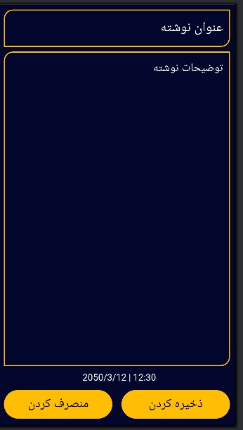

# اپلیکیشن مدیریت یادداشت ها

اپلیکیشن اموزشی ساده برای مدیریت یادداشت ها که با  تکنولوژی Room نوشته شده.  

- مدیریت یادداشت  ( ذخیره کردن هر یادداشت در پایگاه داده و مدیریت ان)
  
.

## عملکرد برنامه
- عملیات اصلی : (عملیات اضافه کردن یک یادداشت  و حذف یادداشت و بازگرداندن ان)
   

## تکنولوژی‌های استفاده شده
- زبان: **Kotlin**
- کتابخانه های  Room - RecyclerView - constraintlayout  -
- بخش Ui با Xml 

- محیط توسعه: **Android Studio**
 minSdk = 24
targetSdk = 34
- کد های منسوخ شده

<table style="width:100%">
  <tr>
    <td></td> 
    <td></td> 
  </tr>
  

